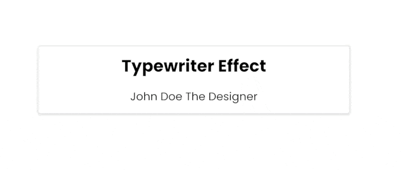

## 📦 Typewriter  Component

### Обзор

Код представляет собой JavaScript-класс, который создает эффект пишущей машинки для текста и вставляет его в указанный HTML-элемент.

### Импорт стилей
Импортируются стили из файла `style.scss`, которые могут быть применены к элементам на странице.

### Класс "Typewriter"
Этот класс реализует эффект пишущей машинки для текста.

#### Поля класса
- `targetElement: HTMLSpanElement`: HTML-элемент, в который будет вставлен текст.
- `words: string[]`: Массив слов для анимации.
- `wait: number`: Задержка перед началом следующей анимации.
- `txt: string`: Текущий текст для анимации.
- `wordIndex: number`: Индекс текущего слова в массиве `words`.
- `isDeleting: boolean`: Флаг, указывающий, происходит ли удаление текста.

### Конструктор
- Принимает следующие параметры:
  - `targetElementSelector: string = ''`: Селектор целевого элемента, в который будет вставлен текст.
  - `wordsAttribute: string = ''`: Атрибут элемента, содержащий JSON-массив слов для анимации.
  - `wait: number = 3000`: Задержка перед началом следующей анимации.
- Создает DOM-структуру, устанавливает необходимые обработчики событий и инициализирует анимацию.

### Приватные методы
- `initialize(): void`: Инициализация класса.
- `createDOM(): void`: Создает необходимую структуру DOM, включая пример использования.
- `setupEventListeners(): void`: Устанавливает обработчики событий.
- `typing()`: Осуществляет анимацию текста.

### Пример использования
Создается экземпляр класса `Typewriter` с указанием селектора целевого элемента и атрибута, содержащего массив слов для анимации. Эффект пишущей машинки начинает работать после инициализации.

---

#### 🌄 Preview:

-----

#### 🙌 Author: [@nagoev-alim](https://github.com/nagoev-alim)

